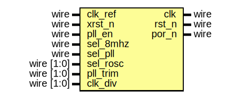

# Reset and Clock Controller for SoC Designs
This repo contains a hard IP for the Sky130 technology that can be used to manage the clocking and resetting for a simple SoC design (e.g., a small MCU). 
## Features:
This IP provides the following features:
- On-chip Power on Reset (PoR). 
- External Reset Synchronization.
- Frequency Multiplier (8X) for external clock source.
- On-chip Ring Oscillator.
- Dynamic Clock Switching.
- Dynamic Frequency Scaling.

## The Interface:

| Port name | Direction | Type       | Description |
| --------- | --------- | ---------- | ----------- |
| clk_ref   | input     | wire       | External reference clock for the PLL             |
| xrst_n    | input     | wire       | External Active-low reset            |
| pll_en    | input     | wire       | PLL Enable            |
| sel_8mhz  | input     | wire       | MUX0 Selection; 1:8MHz (Ring Osc), 0:MUX1 output|
| sel_pll   | input     | wire       | MUX1 Selection; 1:PLL Output, 0:Ring Oscillator variable output          |
| sel_rosc  | input     | wire [1:0] | Set the Ring Oscillator output frequency (0:128MHz, 1:64MHz, 2:32MHz, 3:16MHz)           |
| pll_trim  | input     | wire [1:0] | PLL trimming            |
| clk_div   | input     | wire [1:0] | MUX0 output divisor (1/2/4/8)            |
| clk       | output    | wire       | System Clock            |
| rst_n     | output    | wire       | System Reset (Active-low)            |
| por_n     | output    | wire       | Power on Reset (Active-low)            |